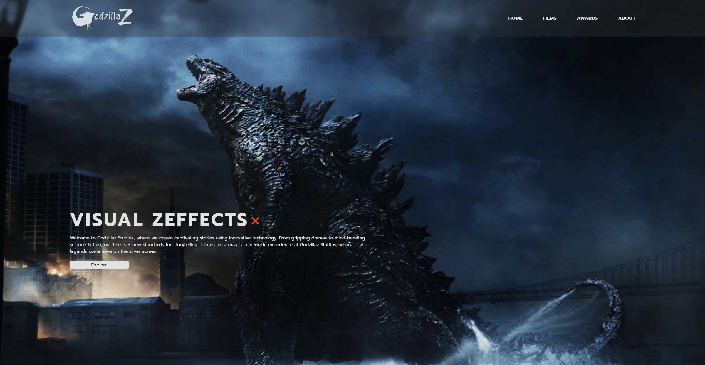
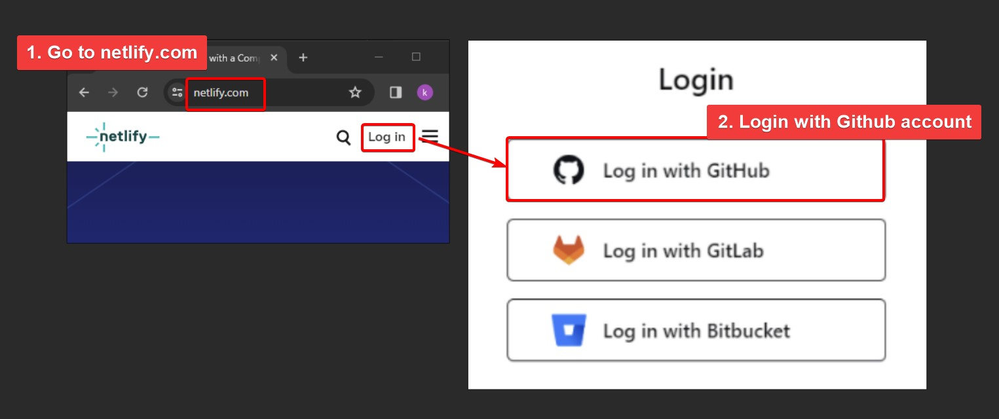
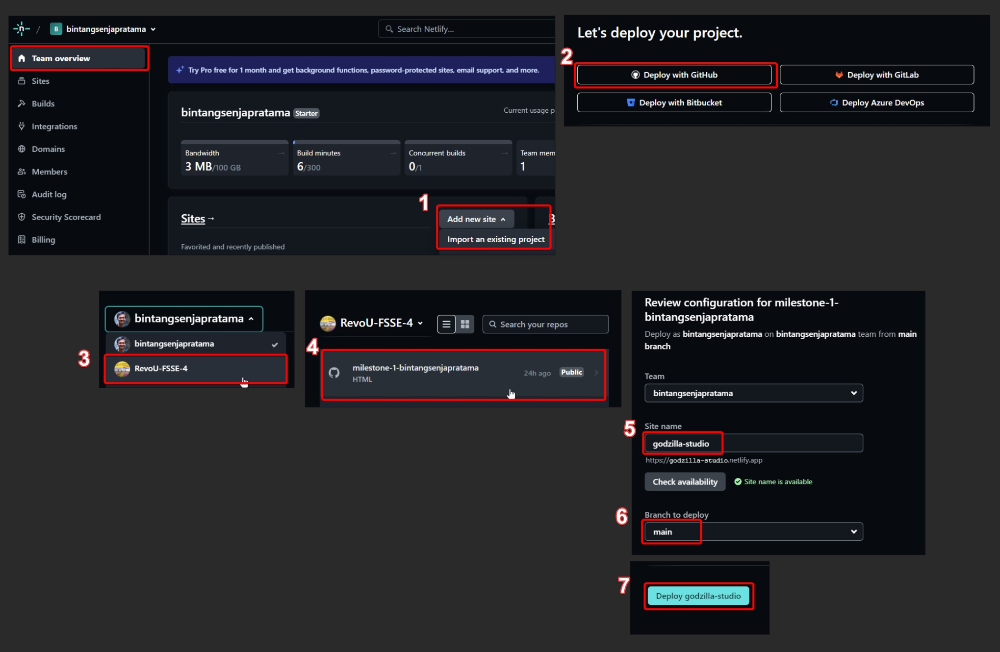
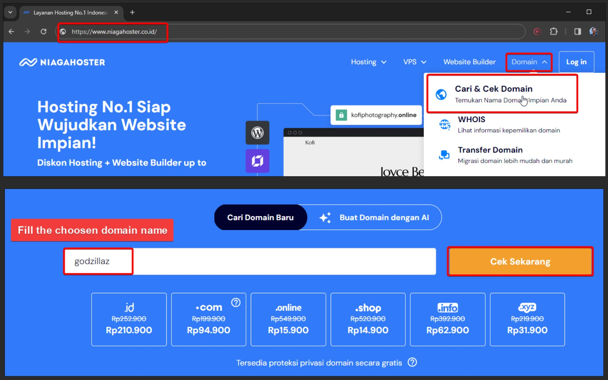
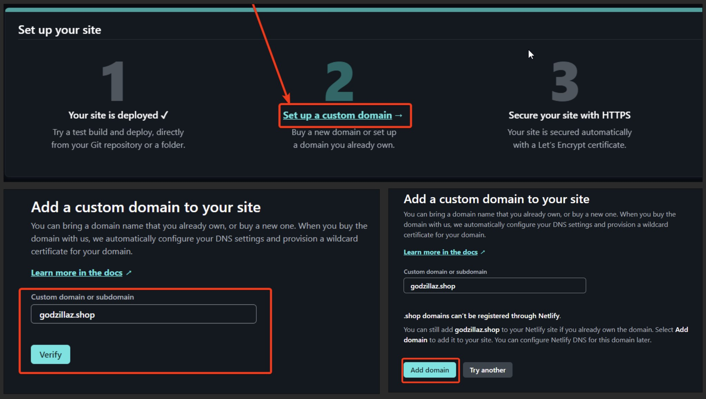
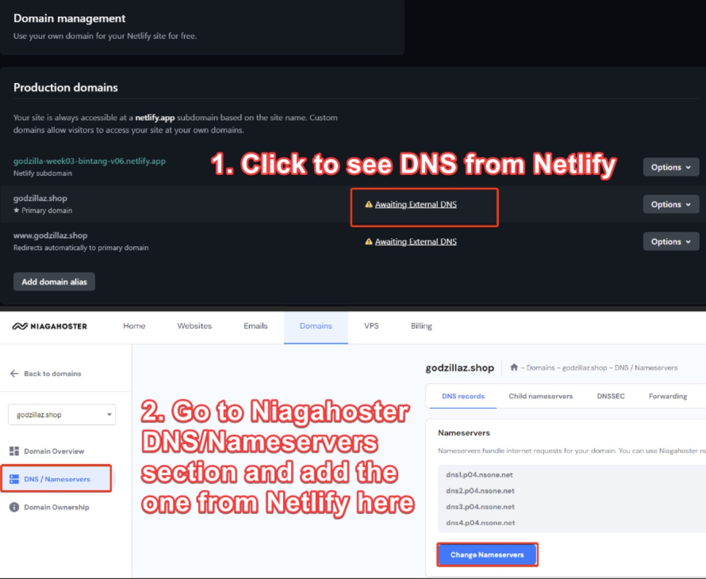
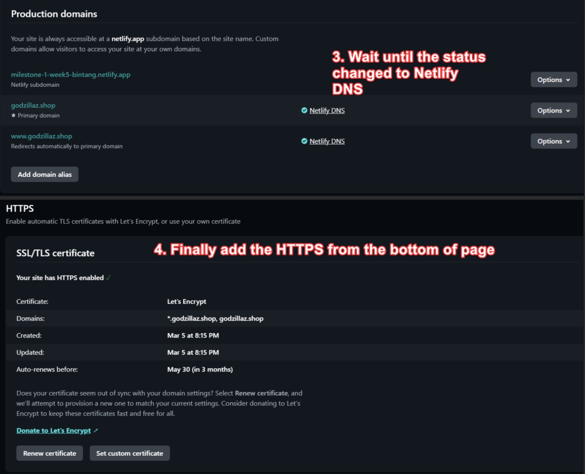

# GodzillaZ Studio

Welcome to GodzillaZ Studio Web Repository!

This website repository showcases the movie production house that is focusing on creating Godzilla movies.


## Repo Structures

- assets folder
  - css
  - images
- readme-images
- index.html
- README.md

## Site Structure

- Navbar
- Main section
- Film section
- Awards section
- About section
- Footer section

## Tools and Recipe

- HTML
- CSS
- Icon and Images
- VS Code Editor
- Photoshop
- SVG Editor ( https://boxy-svg.com/ )
- Person Generation ( https://this-person-does-not-exist.com/en )
- Favicon Converter ( https://favicon.io/favicon-converter/ )

## Quick Start to Setup

1. Clone the repo:

```bash
git clone https://github.com/RevoU-FSSE-4/milestone-1-bintangsenjapratama.git
```

2. Create new branch named "dev"

```bash
git branch -b dev
```

3. Checkout to "dev"

```bash
git checkout dev
```

## Deployment and Custom Domain

1. Get Netlify account, then login with Github account
   

2. Deploy with Github
   

3. Buy Domain using Niagahoster
   

4. Custom Domain setting inside Netlify
   

5. Setting up DNS from Netlify to Niagahoster
   
   

## Thanks

Enjoy discovering the GodzillaZ studio website!
